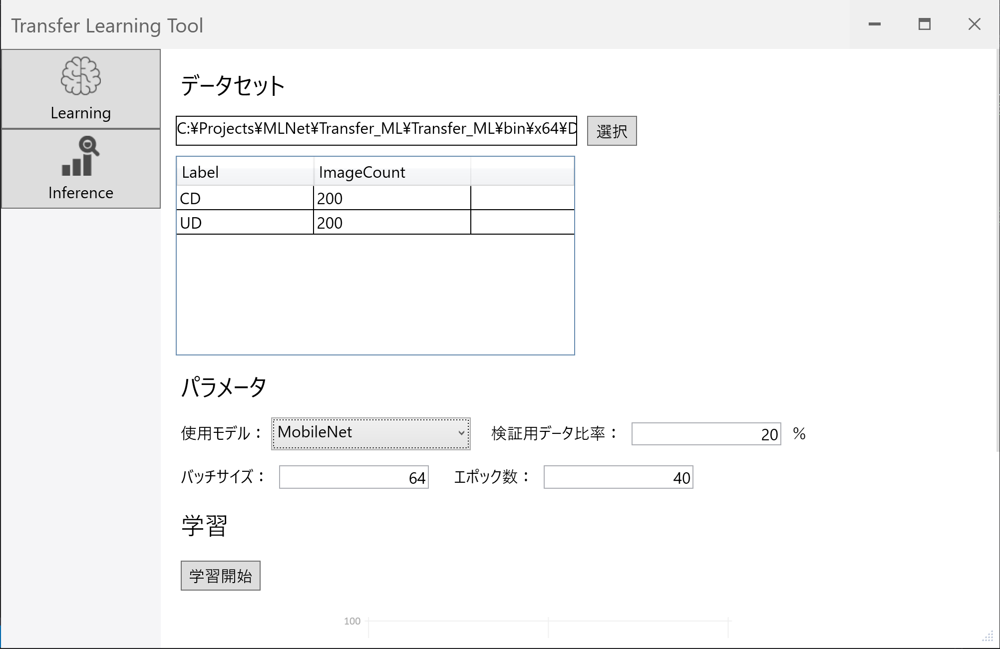
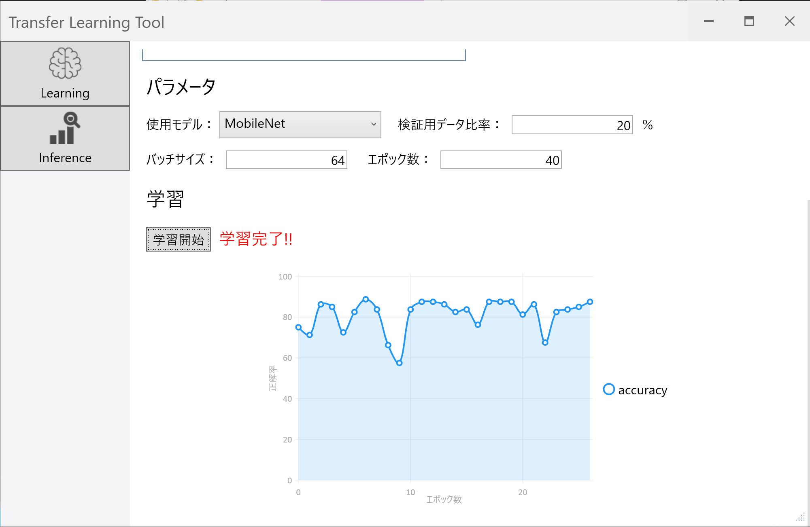

# Transfer Learning Tool

- Transfer Learning Tool はC#で機械学習を行うライブラリ「ML.NET」を使って転移学習を行うサンプルプログラムになります。

- データセットを選択し、簡単なパラメータを設定するだけで画像の転移学習を行うことができます。

  

- 現在、使用できるアーキテクチャは以下の4つになります。

  - ResnetV2 101レイヤー
  - InceptionV3
  - MobilenetV2
  - ResnetV2 50レイヤー

- 学習中は、エポックごとの正解率がグラフで表示されます。

  

- 詳しい使い方はnoteに記事をまとめているので、ご覧ください

  [ML.NETで機械学習③-UIの開発-](https://note.com/tech_kind/n/n820e14a8c683)

  